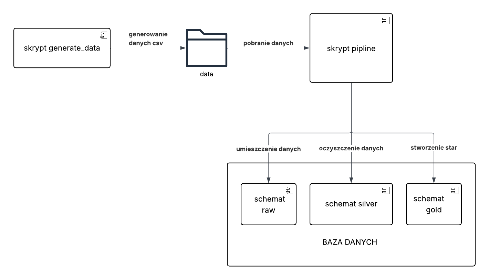

# BGD_zadanie1
## Skrypt generate_data 

Generuje sztuczne dane na potrzeby zadania i umieszcza w katalogu data w jednym pliku csv. 
Problemy z danymi: 
- czasami null w kolumnie transaction_id
- błędna wartośc w kolumnie amount 
- błędna wartośc w kolumnie transaction_ts 
- duże i małe wyrazy określające ten sam status statuses = ["approved", "declined", "pending", "APPROVED"] 
- duże i małe wyrazy określające tą samą metodę płatności payment_methods = ["card", "blik", "transfer", "cash", "CARD"]

## Skrypt pipline 

Skrypt ma trzy metody:
1. RAW – load_raw()

Wczytuje dane z pliku CSV w partiach (chunkach)

Dodaje numer batcha (batch_no)

Zapisuje dane bez transformacji do tabeli:

raw.transactions_raw

Cel: przechowywanie surowych danych

2. SILVER – build_silver()

Pobiera dane z warstwy RAW batchami

Czyści i normalizuje dane:

format tekstów (np. title, lower, upper)

konwersja dat (transaction_ts)

konwersja liczb (amount)

Wykonuje walidację:

brak transaction_id

błędna data

błędna lub ujemna kwota

Dodaje kolumny:

is_valid

validation_error

Zapisuje dane do:

silver.transactions_clean

Cel: oczyszczone i zwalidowane dane

3. GOLD – build_gold()

Buduje model analityczny (schemat gwiazdy):

Tabele wymiarów:

gold.dim_customer

gold.dim_merchant

gold.dim_date

Tabela faktów:

gold.fact_transactions

Cechy:

Uwzględnia tylko poprawne dane (is_valid = true)

Usuwa duplikaty (ON CONFLICT DO NOTHING)

Cel: dane gotowe do analizy i raportowania

## Uruchomienie
Generacja danych 

docker compose -f generate_data_docker.yml build 

docker compose -f generate_data_docker.yml up

Uruchomienie skrytpu pipeline 

docker compose -f pipeline_docker.yml build 

docker compose -f pipeline_docker.yml up 

Podgląd danych 

docker compose -f show_data.yml build 

docker compose -f show_data.yml up

## Sql tworzący bazę danych
BGD_zadanie1/pipeline/init.sql

## Przydatne sql
SELECT count(1) FROM "raw".transactions_raw

SELECT count(1) FROM silver.transactions_clean

select * from gold.fact_transactions limit 1000

SELECT 
    schemaname,
    relname AS table_name,
    pg_total_relation_size(relid) / 1024 / 1024 / 1024 AS size_gb,
	pg_total_relation_size(relid) / 1024 / 1024 AS mb_gb
FROM pg_catalog.pg_statio_user_tables
ORDER BY size_gb DESC

## Architektura

